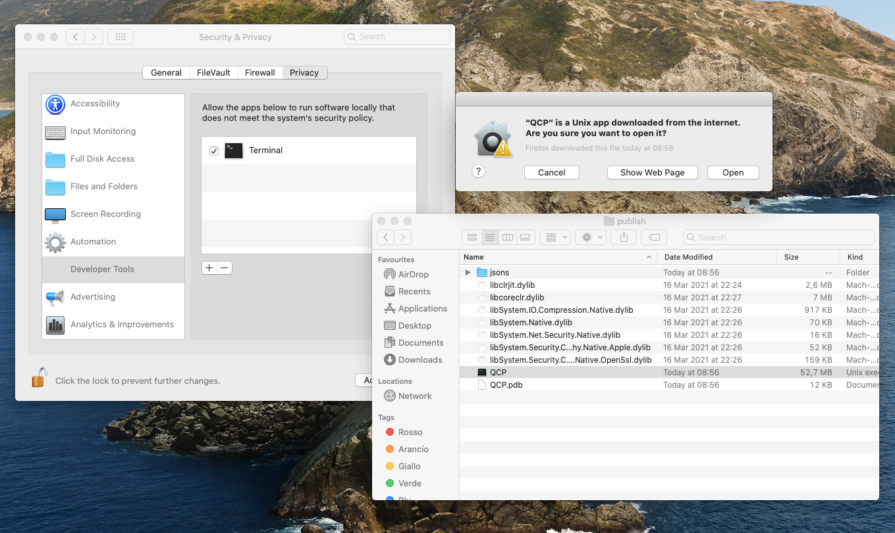
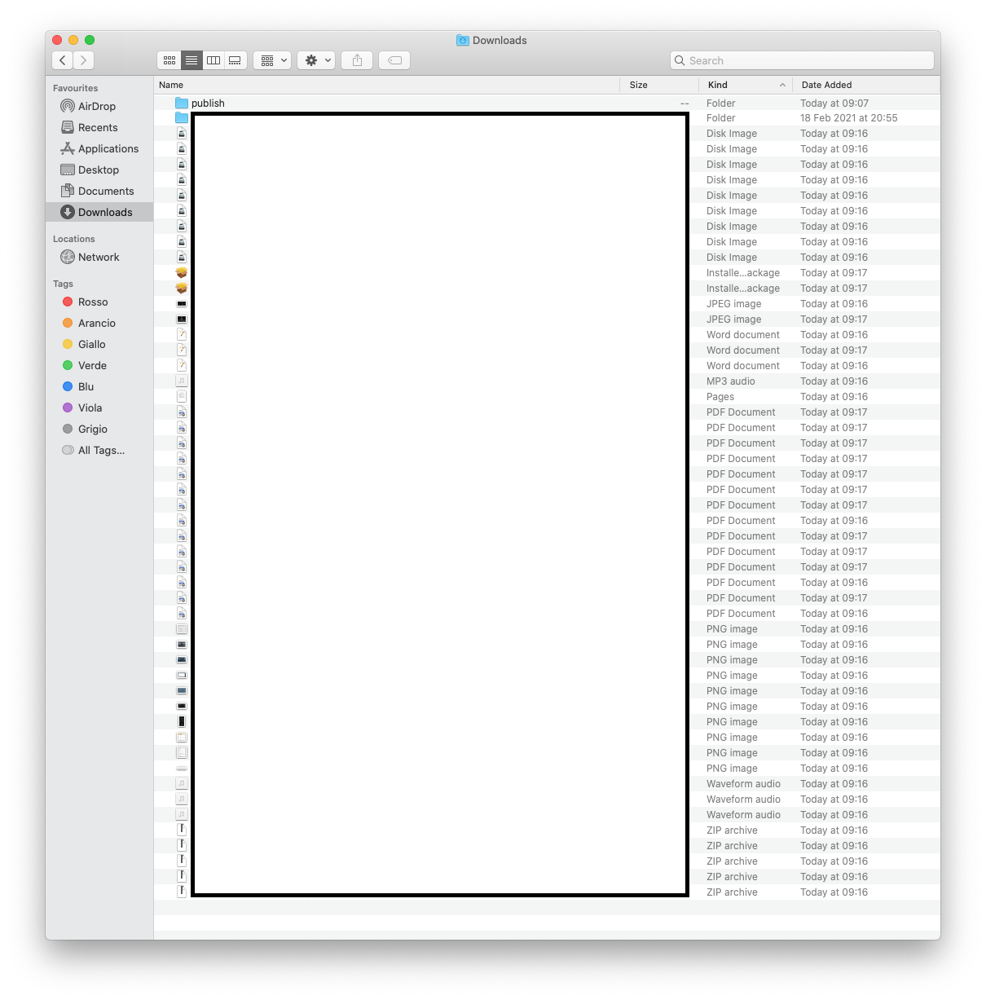
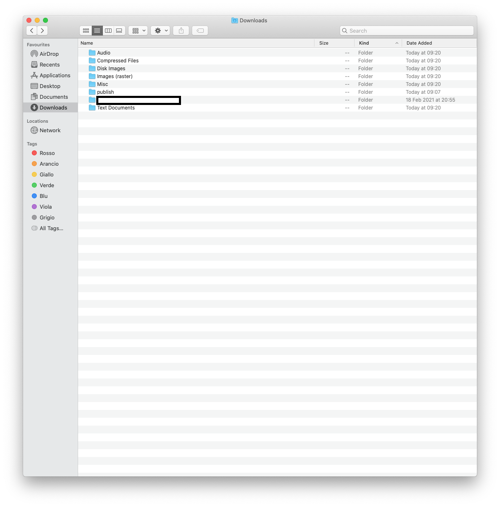
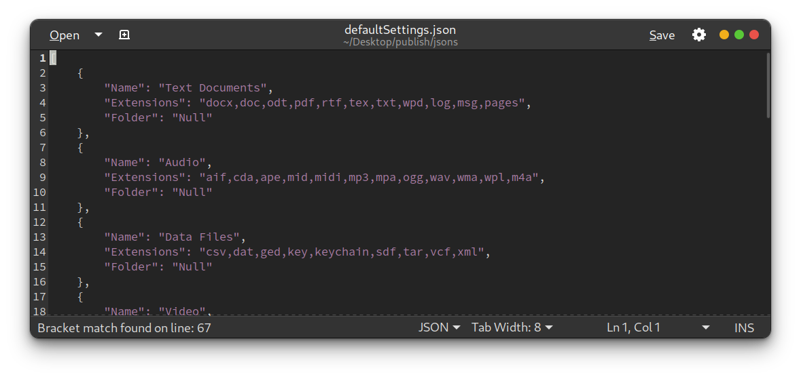

# QCP!  - Configurable folder organizer

## Download

[Download QCP for your OS from this link](https://github.com/GGrassia/QCP/releases)

## The name:_"Questa Cartella è un Porcile!"_

Roughly translating to "This folder is a bloody mess!", QCP! gets its name from a common phrase yelled by Italian mothers when their offspring's room is... Not tidy.
The original phrase obviously hints at a room, not a folder, and "porcile" means pigsty, I'll leave you to your own conclusions.

- [QCP!  - Configurable folder organizer](#qcp----configurable-folder-organizer)
  - [Download](#download)
  - [The name:_"Questa Cartella è un Porcile!"_](#the-namequesta-cartella-è-un-porcile)
  - [Features](#features)
    - [Why not a background running script?](#why-not-a-background-running-script)
  - [How to use QCP, for everyone](#how-to-use-qcp-for-everyone)
    - [On Windows](#on-windows)
    - [On Linux](#on-linux)
    - [On OSX](#on-osx)
  - [Configuration for lazy people (I feel you guys)](#configuration-for-lazy-people-i-feel-you-guys)
  - [Configuration for advanced users or config-junkies](#configuration-for-advanced-users-or-config-junkies)
  - [How to install](#how-to-install)
    - [Compiling](#compiling)
    - [Downloading](#downloading)
  - [How to run at startup](#how-to-run-at-startup)
  - [Future features](#future-features)
  - [Requests](#requests)
  - [Big thank you to](#big-thank-you-to)
    - [The senpai](#the-senpai)
    - [The betatesters](#the-betatesters)
  - [Donations](#donations)

## Features

- **Sort files based on extension**

> Since both Windows and OSX use extensions to know how to open a file, I figured it would be simpler to use the same criterion to sort the files.

- **Rename moved file if a file with the same name is already present**

> Because overwriting without prompts is BAD.

- **Json based configuration**

> Easy to read, check, edit and customize.

- **Automatic folder creation based on file type**

> Because sometimes, you need to be shown order to start thinking tidy.

- **Optional one by one file tidying up**
  
[Are you satisfied?](images/satisMode.gif)

> Some people might find it satisfying, others want to see the program working, so there you go.

### Why not a background running script?

Because I find real time sorting unproductive.  
If I've downloaded something, the first place I'll look for it is the Downloads folder.  
Having to think what kind of file I have downloaded and then search for the corresponding folder means to rewire the brain, why do it when you can just cleanup each time you open up your computer?

## How to use QCP, for everyone

1. Download the .zip for your OS of choice. (Or compile it!) [Here's the releases page](https://github.com/GGrassia/QCP/releases/tag/v1.0)

2. Unzip the downloaded file in a place you will remember.

3. Run QCP! by double clicking it. There are minor differences in running, detailed below.

> Warning, if you have set nothing up and try to use defaults it will crash.

### On Windows

Open the folder you have unzipped and run QCP.exe. On the first launch, Windows should now prompt you this screen.

No worries! Just press on "More info" and the on the "Run Anyway" button.

### On Linux

If you can't open it by double clicking, open a terminal, drag it in and press enter.

### On OSX

***QCP IS MADE IN .NET 5.0, SO IT'S NOT COMPATIBLE WITH OSX 10.12 SIERRA AND BEFORE***

Just double click (or right click and say open) it but...  
***Sigh***  
On first launch only (unless you re-download QCP or something), you'll have to open QCP a couple of times and tell the Mac (from the `System Preferences`=>`Security & Privacy`=>`General` tab) every time to open QCP and the libraries it's stopping.  

[If you want to see how it looks like, here's a guide for an older version of QCP](https://youtu.be/HoT2q4YbEkY)

Here's a simple solution to the problem.

- Before running QCP, go to your `System Preferences` => `Security & Privacy` and open the `Privacy` tab. Now scroll down to the `Developer Tools` option and add the terminal to that window. Select the flag and open QCP, now you can run it without scary prompts. You can also take out the flag now, so prompts for other apps will open.

> I don't like it, but Apple has this ~~bullshit~~ protection method... If the project gets a lot of interest I might consider buying an apple certified developer stuff to avoid all this. Any eventual donation will go towards that specific goal until completed.

## Configuration for lazy people (I feel you guys)

  In the jsons folder inside the QCP folder there is a file called `startup.json`, open it with a text editor.

  
  

  > Json files are a kind of text file, easy to read for you and the computer, nothing to be worried about!

- ***You could skip editing the startup json, but it would mean you have to press some buttons, and insert a path manually EVERY TIME, you don't want that, do you?***

Well then, in the `"DefaultFolder"` field there should be some text, delete it and put the path of the folder you want to keep tidy. Since version 1.1 you can add multiple folders to be tidied, just remember to separate the paths with a comma `","`.

> Since I myself also had a little trouble with finding the path on OSX, you can copy the path from the Finder, just select the folder and then click on "copy xyz as Pathname" from the Finder's edit menu on the topbar. You can paste it later even in the terminal with cmd+V. You're welcome!

- In the `startup.json` edit to `"true"` the `SilentMode` and/or `LaunchAtLogin` (not working on Linux, will work in next versions) fields.
- QCP runs slow by default. If you want to speed it up set `SlowMode` to `false`.

  **Done**!

> After launching QCP, in the paths given to the `startup.json` you'll find some new folders with the files neatly divided between them based on the file type. Keep in mind there are default categories for the most used file types, every other less used file will be in a `"Misc"` folder.

> Before...

> And After!

## Configuration for advanced users or config-junkies

All right. You want to know stuff eh?  
Well, basically it's all in the settings json file.

> (It will be `defaultSettings.json` in the folder, copy it and make your own if you want).

Backup the default file, in case you break something.

- The settings are divided in blocks which hold the information QCP needs to work, you can add or remove blocks as you please, just stick to the syntax.

Blocks have the following fields:

1. `"Name"`: which is the name of the generic folder QCP will create based on that file type group, also serves as a quick way of knowing what grouping are you looking at.

2. `"Extensions"`: these are the extensions linked to the filetypes. If you want to move, add or remove an extension, **make sure** you don't leave double commas or spaces in the file.  
If you want pdfs with pictures and not text documents, editing this file you can.

3. `"Folder"`: here you can put the custom path for a filetype group. QCP won't make a new folder if you have given it a valid custom path (checks if the folder exists to know it), but will just move the files there.

> If `Folder` is not "null", QCP will make a custom folder with the `Folder` field as it's name, you have been warned!

 Now that you know how QCP behaves, customize it to taste then follow the lazy people guide so it can run smoothly even for you.

 Don't forget to put the customized (if you haven't simply modified the `defaultSettings.json` file) settings file name inside the `startup.json` one otherwise you won't have your custom settings!

## How to install

### Compiling

Clone the repo and compile from source. Only thing needed is the .NET 5.0 SDK.

### Downloading

Choose the release zip corresponding to your OS, unzip somewhere you will remember. [Here's the releases page](https://github.com/GGrassia/QCP/releases)

## How to run at startup

Change to `true` the `LaunchAtLogin` field inside the `startup.json`. Windows will tell you it's trying to run when you log in, just say yes.  

On Linux... It depends on your distro... So... Uhm... Refer to your distro's documentation... or look here [this is a guide](https://www.howtogeek.com/687970/how-to-run-a-linux-program-at-startup-with-systemd/)

## Future features

1. Automatic start at login on Linux.

2. MacOSX Certified developer signature, just to bypass the Apple BS on running the app.

3. No idea, so, requests and ideas are more than welcome!

## Requests

> Do you have ideas for new features or have you found bugs/nonsense in the code? Pull requests and ideas, as already said, are highly appreciated!

## Big thank you to

### The senpai

@davidetestoni, who got me into coding and C#. Also, HUGE HELP and guide in developing QCP and all my C# software.

### The betatesters

"ILMASTAH" and Dario, friends who endured my tiring messages and proud boastings of broken code.

## Donations

QCP comes absolutely free.  
As a long time GNU/Linux user, free software has been a staple of my experience and I wanted to give something back, also I have a job, so I don't need the money.  
That said, if you want to support me, or buy me a coffee (which I won't buy until I have bought the Apple Certification, unless you specifically tell me otherwise) here's a way to.

